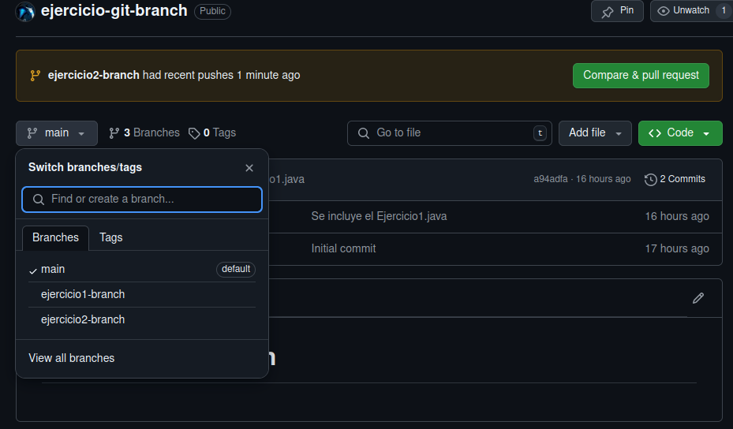
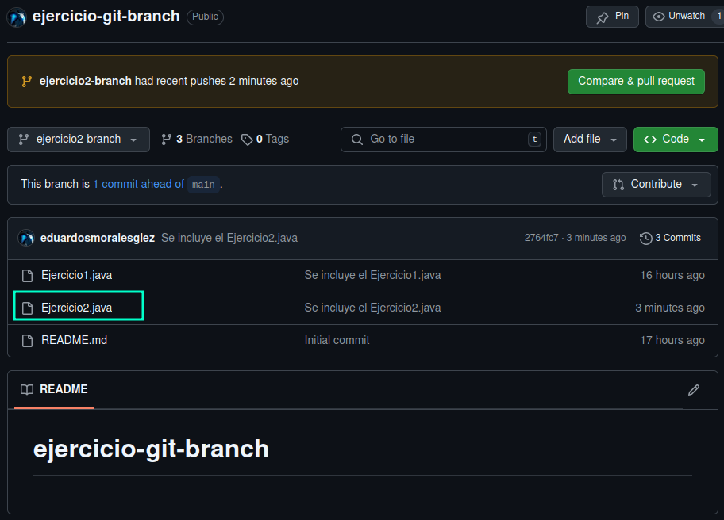
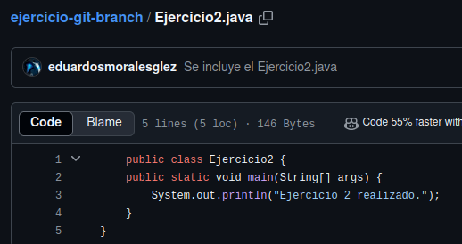
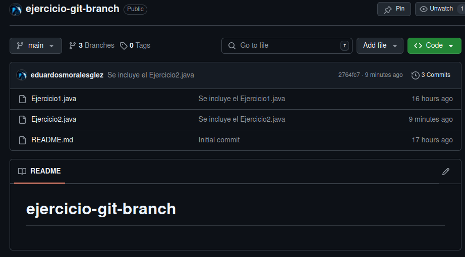
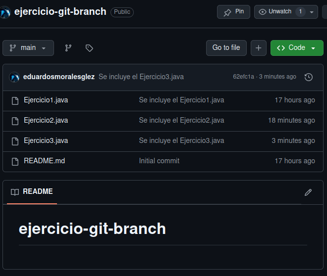

<div align="justify">

# Entornos de desarrollo.

## Comenzando con Git "Trabajando con Branchs"

### Hecho por Eduardo Serafín Morales González.

En esta tarea vamos a trabajar con la ___función de ramas de git___. Crearemos distintas ramas para distintos ejercicios y las uniremos a la rama main.
 
## 2 Clonación del repositorio.

- Para ello usaremos el comando _"git clone"_ y añadiremos nuestro usuario de GitHub y nuestro Token de autentificación.
```code
bae2@jpexposito-VirtualBox:~/repositorios$ git clone https://github.com/eduardosmoralesglez/ejercicio-git-branch
Clonando en 'ejercicio-git-branch'...
Username for 'https://github.com': eduardosmoralesglez
Password for 'https://eduardosmoralesglez@github.com': 
remote: Enumerating objects: 3, done.
remote: Counting objects: 100% (3/3), done.
remote: Total 3 (delta 0), reused 0 (delta 0), pack-reused 0 (from 0)
Recibiendo objetos: 100% (3/3), listo.
```
## 3 Creación de la rama.

- Pra crear una rama en git usaremos el comando `git checkout -b ejercicio1-branch`. Este comando crea la rama y entrar en ella al mismo tiempo, pero podemos también usar estos dos comandos:
  - `git branch ejercicio1-branch`
  - `git checkout ejercicio1-branch`


```code
bae2@jpexposito-VirtualBox:~/repositorios/ejercicio-git-branch$ git checkout -b ejercicio1-branch
Cambiado a nueva rama 'ejercicio1-branch'
bae2@jpexposito-VirtualBox:~/repositorios/ejercicio-git-branch$ 
```
## 4 Añadimos un fichero a la rama.

- Simplemente creamos un fichero __"Ejercicio1.java"__ con el siguiente contenido 
```code
    public class Ejercicio1 {
    public static void main(String[] args) {
       System.out.println("Ejercicio 1 realizado.");
    }
  }    
```
- En mi caso use el comando nano para crear el fichero.
---
```code
bae2@jpexposito-VirtualBox:~/repositorios/ejercicio-git-branch$ nano Ejercicio1.java
bae2@jpexposito-VirtualBox:~/repositorios/ejercicio-git-branch$ ls
Ejercicio1.java  README.md
bae2@jpexposito-VirtualBox:~/repositorios/ejercicio-git-branch$ cat Ejercicio1.java 
     public class Ejercicio1 {
     public static void main(String[] args) {
         System.out.println("Ejercicio 1 realizado.");
     }
 }
bae2@jpexposito-VirtualBox:~/repositorios/ejercicio-git-branch$ 
```
## 5 Guardar los cambios en la rama.

- En este paso usaremos muchos comando de git. Para empezar usaremos el comando ___git status___ para comprobar el estado de nuestro repositorio y ver si hay ficheros que no estén guardados, en este caso el fichero __"Ejercicio1-branch"__.

```code
bae2@jpexposito-VirtualBox:~/repositorios/ejercicio-git-branch$ git status 
En la rama ejercicio1-branch
Archivos sin seguimiento:
  (usa "git add <archivo>..." para incluirlo a lo que será confirmado)
	Ejercicio1.java

no hay nada agregado al commit pero hay archivos sin seguimiento presentes (usa "git add" para hacerles seguimiento)
```
- Usamos el comando ___git add___ para aplicarle seguimiento al fichero dentro del repositorio.

```code
bae2@jpexposito-VirtualBox:~/
repositorios/ejercicio-git-branch$ git add Ejercicio1.java 
bae2@jpexposito-VirtualBox:~/repositorios/ejercicio-git-branch$ git status 
En la rama ejercicio1-branch
Cambios a ser confirmados:
  (usa "git restore --staged <archivo>..." para sacar del área de stage)
	nuevos archivos: Ejercicio1.java
```
- Para guardar los cambios usamos el comando ___git commit -m__ para hacer un guardado y poner un comentario sobre el guardado (commit).

```code
bae2@jpexposito-VirtualBox:~/repositorios/ejercicio-git-branch$ git commit -m "Se incluye el Ejercicio1.java"
[ejercicio1-branch a94adfa] Se incluye el Ejercicio1.java
 1 file changed, 5 insertions(+)
 create mode 100644 Ejercicio1.java
bae2@jpexposito-VirtualBox:~/repositorios/ejercicio-git-branch$ 
```
## 6 Subimos los cambios a nuestro repositorio.
- Para finalizar y guardar los cambios que hemos realizado en nuestro repositorio local, hacemos un _"push"_ a nuestro repositorio en la nube

```code
bae2@jpexposito-VirtualBox:~/repositorios/ejercicio-git-branch$ git push origin ejercicio1-branch 
Username for 'https://github.com': eduardosmoralesglez
Password for 'https://eduardosmoralesglez@github.com': 
Enumerando objetos: 4, listo.
Contando objetos: 100% (4/4), listo.
Compresión delta usando hasta 4 hilos
Comprimiendo objetos: 100% (3/3), listo.
Escribiendo objetos: 100% (3/3), 416 bytes | 416.00 KiB/s, listo.
Total 3 (delta 0), reusados 0 (delta 0), pack-reusados 0
remote: 
remote: Create a pull request for 'ejercicio1-branch' on GitHub by visiting:
remote:      https://github.com/eduardosmoralesglez/ejercicio-git-branch/pull/new/ejercicio1-branch
remote: 
To https://github.com/eduardosmoralesglez/ejercicio-git-branch
 * [new branch]      ejercicio1-branch -> ejercicio1-branch
bae2@jpexposito-VirtualBox:~/repositorios/ejercicio-git-branch$ 
```

## 7 Fusionamos la rama __"ejercicio1-branch"__ con la rama __"main"__

- Ahora para fusionar las ramas tenemos que asegurarnos que estamos en la rama main usando el comando:
  - `git checkout main`

- Para fusionar las ramas y que el contenido de la rama se junte con la main , usando este comando:
- `git merge ejercicio1-branch`

- Luego de unir las ramas hacemos un "git push" y guardamos los cambios en GitHub.

```code
bae2@jpexposito-VirtualBox:~/repositorios/ejercicio-git-branch$ git checkout main 
Cambiado a rama 'main'
Tu rama está actualizada con 'origin/main'.
bae2@jpexposito-VirtualBox:~/repositorios/ejercicio-git-branch$ git merge ejercicio1-branch 
Actualizando eb91296..a94adfa
Fast-forward
 Ejercicio1.java | 5 +++++
 1 file changed, 5 insertions(+)
 create mode 100644 Ejercicio1.java
bae2@jpexposito-VirtualBox:~/repositorios/ejercicio-git-branch$ git push
Username for 'https://github.com': eduardosmoralesglez
Password for 'https://eduardosmoralesglez@github.com': 
Total 0 (delta 0), reusados 0 (delta 0), pack-reusados 0
To https://github.com/eduardosmoralesglez/ejercicio-git-branch
   eb91296..a94adfa  main -> main
bae2@jpexposito-VirtualBox:~/repositorios/ejercicio-git-branch$ 
```

## Repetición - ejercicio 2
### Creación de la rama:

```code
bae2@jpexposito-VirtualBox:~/repositorios/ejercicio-git-branch$ git checkout -b ejercicio2-branch
Cambiado a nueva rama 'ejercicio2-branch'
bae2@jpexposito-VirtualBox:~/repositorios/ejercicio-git-branch$ 
```
### Creación del fichero:

```code
bae2@jpexposito-VirtualBox:~/repositorios/ejercicio-git-branch$ nano Ejercicio2.java 
bae2@jpexposito-VirtualBox:~/repositorios/ejercicio-git-branch$ ls
Ejercicio1.java  Ejercicio2.java  README.md
bae2@jpexposito-VirtualBox:~/repositorios/ejercicio-git-branch$ cat Ejercicio2.java 
     public class Ejercicio2 {
     public static void main(String[] args) {
         System.out.println("Ejercicio 2 realizado.");
     }
 }
bae2@jpexposito-VirtualBox:~/repositorios/ejercicio-git-branch$ 
```
### Crear un commit y subirlo a GitHub:

```code  
bae2@jpexposito-VirtualBox:~/repositorios/ejercicio-git-branch$ git status 
En la rama ejercicio2-branch
Archivos sin seguimiento:
  (usa "git add <archivo>..." para incluirlo a lo que será confirmado)
	Ejercicio2.java

no hay nada agregado al commit pero hay archivos sin seguimiento presentes (usa "git add" para hacerles seguimiento)
bae2@jpexposito-VirtualBox:~/repositorios/ejercicio-git-branch$ git add Ejercicio2.java 
bae2@jpexposito-VirtualBox:~/repositorios/ejercicio-git-branch$ git status 
En la rama ejercicio2-branch
Cambios a ser confirmados:
  (usa "git restore --staged <archivo>..." para sacar del área de stage)
	nuevos archivos: Ejercicio2.java

bae2@jpexposito-VirtualBox:~/repositorios/ejercicio-git-branch$ git commit -m "Se incluye el Ejercicio2.java"
[ejercicio2-branch 2764fc7] Se incluye el Ejercicio2.java
 1 file changed, 5 insertions(+)
 create mode 100644 Ejercicio2.java
bae2@jpexposito-VirtualBox:~/repositorios/ejercicio-git-branch$ git push origin ejercicio2-branch 
Username for 'https://github.com': eduardosmoralesglez
Password for 'https://eduardosmoralesglez@github.com': 
Enumerando objetos: 4, listo.
Contando objetos: 100% (4/4), listo.
Compresión delta usando hasta 4 hilos
Comprimiendo objetos: 100% (3/3), listo.
Escribiendo objetos: 100% (3/3), 444 bytes | 444.00 KiB/s, listo.
Total 3 (delta 0), reusados 0 (delta 0), pack-reusados 0
remote: 
remote: Create a pull request for 'ejercicio2-branch' on GitHub by visiting:
remote:      https://github.com/eduardosmoralesglez/ejercicio-git-branch/pull/new/ejercicio2-branch
remote: 
To https://github.com/eduardosmoralesglez/ejercicio-git-branch
 * [new branch]      ejercicio2-branch -> ejercicio2-branch
bae2@jpexposito-VirtualBox:~/repositorios/ejercicio-git-branch$ 
```
### Fusionar la rama ejercicio2-branch
```code
bae2@jpexposito-VirtualBox:~/repositorios/ejercicio-git-branch$ git checkout 
bae2@jpexposito-VirtualBox:~/repositorios/ejercicio-git-branch$ git checkout main
Cambiado a rama 'main'
Tu rama está actualizada con 'origin/main'.
bae2@jpexposito-VirtualBox:~/repositorios/ejercicio-git-branch$ git merge ejercicio2-branch 
Actualizando a94adfa..2764fc7
Fast-forward
 Ejercicio2.java | 5 +++++
 1 file changed, 5 insertions(+)
 create mode 100644 Ejercicio2.java
bae2@jpexposito-VirtualBox:~/repositorios/ejercicio-git-branch$ git push
Username for 'https://github.com': eduardosmoralesglez
Password for 'https://eduardosmoralesglez@github.com': 
Total 0 (delta 0), reusados 0 (delta 0), pack-reusados 0
To https://github.com/eduardosmoralesglez/ejercicio-git-branch
   a94adfa..2764fc7  main -> main
bae2@jpexposito-VirtualBox:~/repositorios/ejercicio-git-branch$ 
```
#### Comprobaciones desde el GitHub:

- Comprobamos que el push desde el GitHub.


---
- Comprobamos que el __Ejercicio2.java__ existe.




---
- Fusionamos la rama __ejercicio2-breanh__ con la rama __main__.



## Repetición - ejercicio 3
### Creación de la rama:
```
bae2@jpexposito-VirtualBox:~/repositorios/ejercicio-git-branch$ git checkout -b ejercicio3-branch 
Cambiado a nueva rama 'ejercicio3-branch'
bae2@jpexposito-VirtualBox:~/repositorios/ejercicio-git-branch$ 
```
### Creación del fichero:
```code
bae2@jpexposito-VirtualBox:~/repositorios/ejercicio-git-branch$ nano Ejercicio3.java
bae2@jpexposito-VirtualBox:~/repositorios/ejercicio-git-branch$ ls
Ejercicio1.java  Ejercicio2.java  Ejercicio3.java  README.md
bae2@jpexposito-VirtualBox:~/repositorios/ejercicio-git-branch$ cat Ejercicio3.java 
     public class Ejercicio3 {
     public static void main(String[] args) {
         System.out.println("Ejercicio 3 realizado.");
     }
 }    
bae2@jpexposito-VirtualBox:~/repositorios/ejercicio-git-branch$ 
```
### Crear un commit y subirlo a GitHub:

```code 
bae2@jpexposito-VirtualBox:~/repositorios/ejercicio-git-branch$ git status 
En la rama ejercicio3-branch
Archivos sin seguimiento:
  (usa "git add <archivo>..." para incluirlo a lo que será confirmado)
	Ejercicio3.java

no hay nada agregado al commit pero hay archivos sin seguimiento presentes (usa "git add" para hacerles seguimiento)
bae2@jpexposito-VirtualBox:~/repositorios/ejercicio-git-branch$ git add Ejercicio3.java 
bae2@jpexposito-VirtualBox:~/repositorios/ejercicio-git-branch$ git status 
En la rama ejercicio3-branch
Cambios a ser confirmados:
  (usa "git restore --staged <archivo>..." para sacar del área de stage)
	nuevos archivos: Ejercicio3.java

bae2@jpexposito-VirtualBox:~/repositorios/ejercicio-git-branch$ git commit -m "Se incluye el Ejercicio3.java"
[ejercicio3-branch 62efc1a] Se incluye el Ejercicio3.java
 1 file changed, 5 insertions(+)
 create mode 100644 Ejercicio3.java
bae2@jpexposito-VirtualBox:~/repositorios/ejercicio-git-branch$ git push origin ejercicio3-branch 
Username for 'https://github.com': eduardosmoralesglez
Password for 'https://eduardosmoralesglez@github.com': 
Enumerando objetos: 4, listo.
Contando objetos: 100% (4/4), listo.
Compresión delta usando hasta 4 hilos
Comprimiendo objetos: 100% (3/3), listo.
Escribiendo objetos: 100% (3/3), 471 bytes | 471.00 KiB/s, listo.
Total 3 (delta 0), reusados 0 (delta 0), pack-reusados 0
remote: 
remote: Create a pull request for 'ejercicio3-branch' on GitHub by visiting:
remote:      https://github.com/eduardosmoralesglez/ejercicio-git-branch/pull/new/ejercicio3-branch
remote: 
To https://github.com/eduardosmoralesglez/ejercicio-git-branch
 * [new branch]      ejercicio3-branch -> ejercicio3-branch
bae2@jpexposito-VirtualBox:~/repositorios/ejercicio-git-branch$ 
```
### Fusionar la rama ejercicio3-branch
```code
bae2@jpexposito-VirtualBox:~/repositorios/ejercicio-git-branch$ git checkout main 
Cambiado a rama 'main'
Tu rama está actualizada con 'origin/main'.
bae2@jpexposito-VirtualBox:~/repositorios/ejercicio-git-branch$ git merge ejercicio3-branch 
Actualizando 2764fc7..62efc1a
Fast-forward
 Ejercicio3.java | 5 +++++
 1 file changed, 5 insertions(+)
 create mode 100644 Ejercicio3.java
bae2@jpexposito-VirtualBox:~/repositorios/ejercicio-git-branch$ git push
Username for 'https://github.com': eduardosmoralesglez
Password for 'https://eduardosmoralesglez@github.com': 
Total 0 (delta 0), reusados 0 (delta 0), pack-reusados 0
To https://github.com/eduardosmoralesglez/ejercicio-git-branch
   2764fc7..62efc1a  main -> main
bae2@jpexposito-VirtualBox:~/repositorios/ejercicio-git-branch$ 
```
---
- Comprobamos que la rama __ejercicio3-branch__ se a fusionado con la rama __main__.



Finalizando así la tarea.